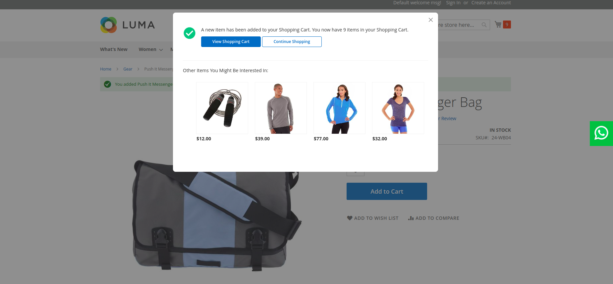

# M2Commerce Commerce: Magento 2 Add to Cart Popup

## Overview
This module displays a responsive popup after a product is added to cart. When the popup is displayed, a few suggested products are also presented to the user
It is fully built with KnockoutJS and also implements a new CustomerData section.

## Configuration

There are several configuration options for this extension, which can be found at **STORES > Configuration > Commerce Enterprise > Add to Cart Popup**.

### ScreenShots


## Installation
### Magento® Marketplace

This extension will also be available on the Magento® Marketplace when approved.

1. Go to Magento® 2 root folder
2. Require/Download this extension:

   Enter following commands to install extension.

   ```
   composer require m2commerce/add-to-cart-popup
   ```

   Wait while composer is updated.

   #### OR

   You can also download code from this repo under Magento® 2 following directory:

    ```
    app/code/M2Commerce/AddToCartPopup
    ```    

3. Enter following commands to enable the module:

   ```
   php bin/magento module:enable M2Commerce_AddToCartPopup
   php bin/magento setup:upgrade
   php bin/magento setup:di:compile
   php bin/magento cache:clean
   php bin/magento cache:flush
   ```

4. If Magento® is running in production mode, deploy static content:

   ```
   php bin/magento setup:static-content:deploy
   ```
